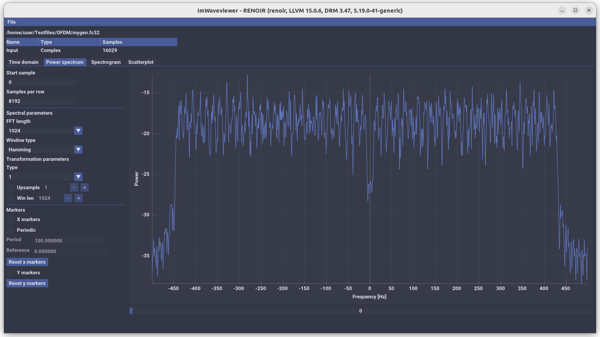
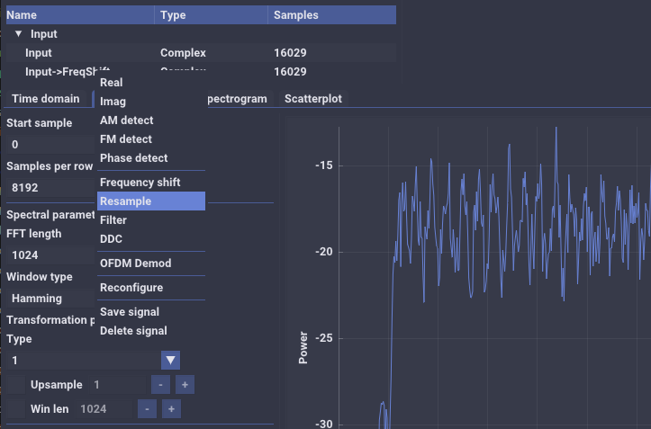

Waveviewer is a tool to analyze signals. Builds on Linux and Mac, mainly tested on Ubuntu.

## Installation and dependencies ##

Dependencies:
- Liquid-dsp
- FFTW
- GLFW
- OpenGl3

Install deps from apt:  
sudo apt install cmake autoconf libglfw3-dev libfftw3-dev 

Install liquid-dsp:  
git clone https://github.com/jgaeddert/liquid-dsp  
cd liquid-dsp  
./bootstrap  
./configure 
make  
sudo make install  

Install Waveviewer:  
git clone --recursive-submodules https://github.com/brageee/Waveviewer  
cd Waveviewer  
mkdir build  
cd build  
cmake ..  
make  

Run waveviewer  
./waveviewer

## Config ##
A config file is created under build/waveviewer.ini . This is a work in progress. At the moment you can set whether or not the default path when running the program should update as you select a new input file (update to the directory of the input file).

## Usage ##

### Plot domains ###
Waveviewer currently provides four plot domains to visualize signals: time domain, power spectrum, spectrogram and scatter plot.

### Processing ###
Waveviewer can also perform some processing on signals. For instance filtering or frequency shifting. This is done by right-clicking the signal name at the upper-left corner and choosing an operation. Waveviewer will then perform the chosen operation and display its output in the plot domain(s). Note that Waveviewer only does the processing for the amount of data required to display the output.

## Credits ##
This project uses code from many projects. GUI uses https://github.com/ocornut/imgui and https://github.com/epezent/implot that have made plotting super easy. Original project was inspired by implot's demos https://github.com/epezent/implot_demos.  I also use https://github.com/AirGuanZ/imgui-filebrowser as file browser.

Many processing operations uses https://github.com/jgaeddert/liquid-dsp, the best DSP library out there. I use https://www.fftw.org/ for FFTs.

The concept of sample sources was inspired by https://github.com/miek/inspectrum. 

The Spectrogram plot domain uses a Largest-Triangle-Three-Buckets algorithm for visual downsampling that I got from https://github.com/parkertomatoes/lttb-cpp.

The OFDM equalizer contains a spline interpolator obtained from https://kluge.in-chemnitz.de/opensource/spline/.